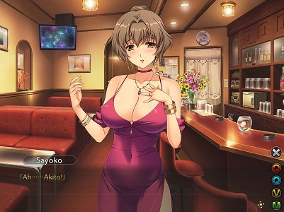

# Tsumamigui 3 translation

## What the patch includes (or not), for now
- Translation of the story very beginning
- Font size change
- No UI translation

## How to patch
- Download a release
- Copy the .ain and .ex files from the patch to your install directory over the existing files
(of course you would be wise to back up the original files)

## How to contribute
If you want to contribute, please send me a mail. I will test you to ensure that you can contribute with a minimum level of quality.

## Thanks
Thanks to nunuhara for alice-tools. I am using these tools to extract the game text data and patch the game files.
